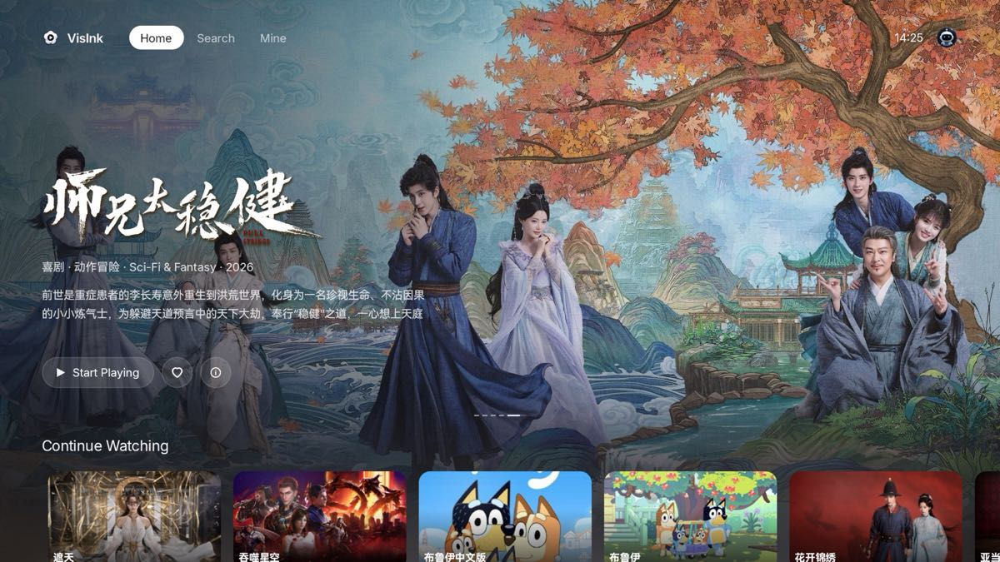
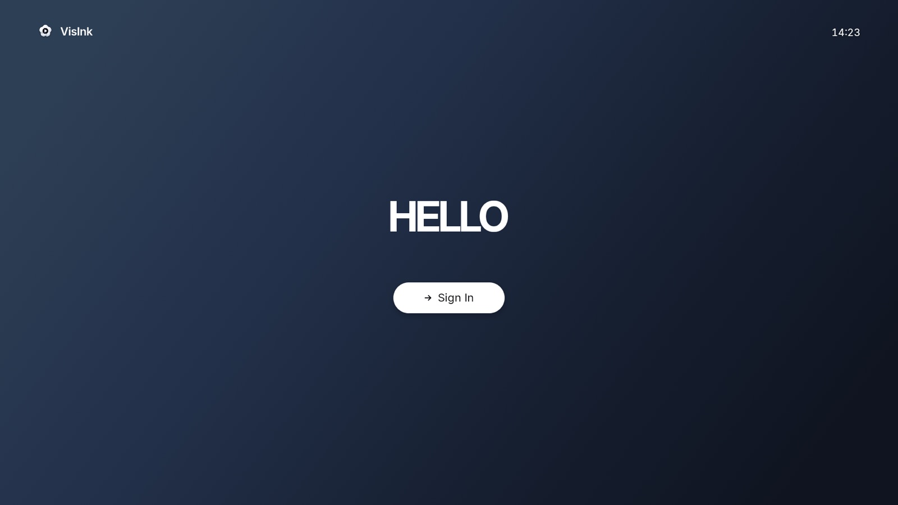
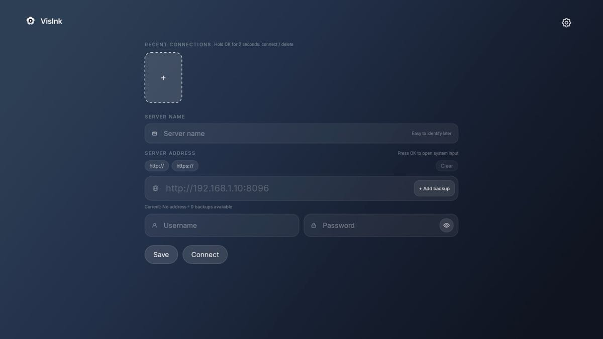
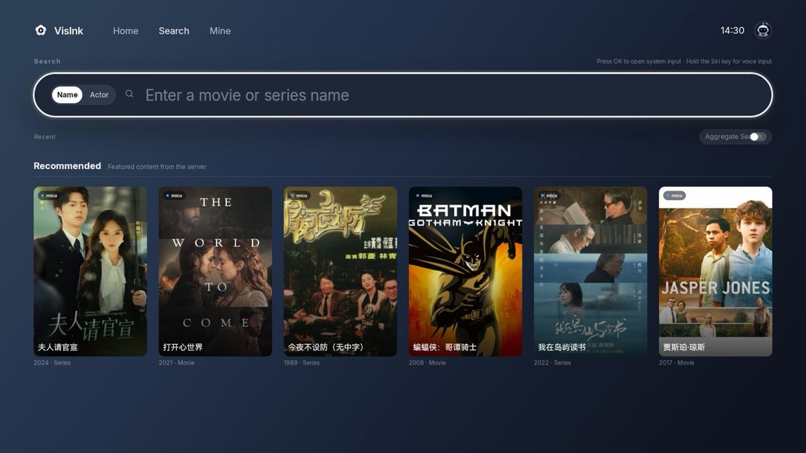
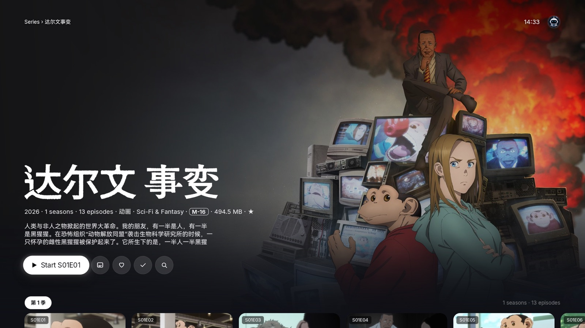
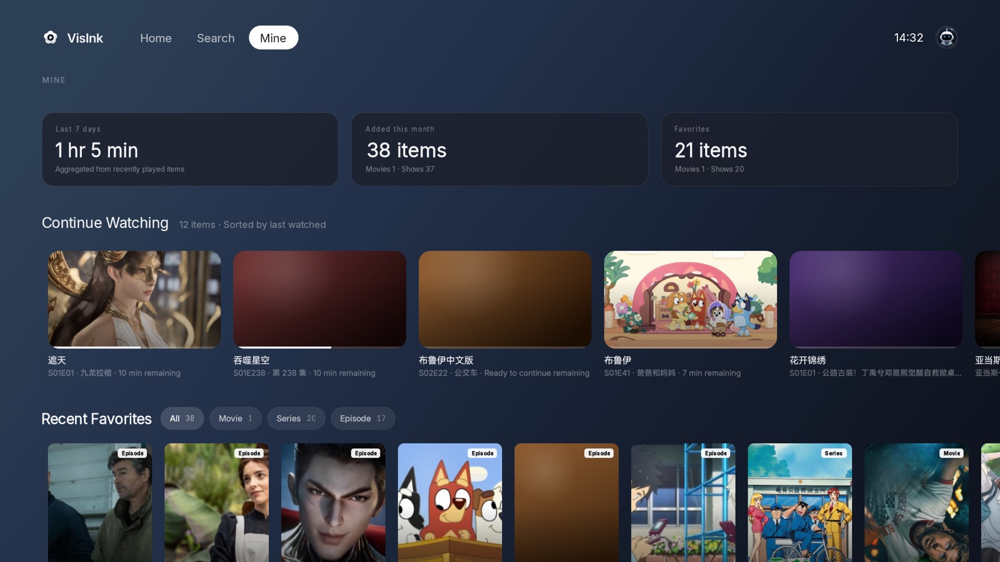
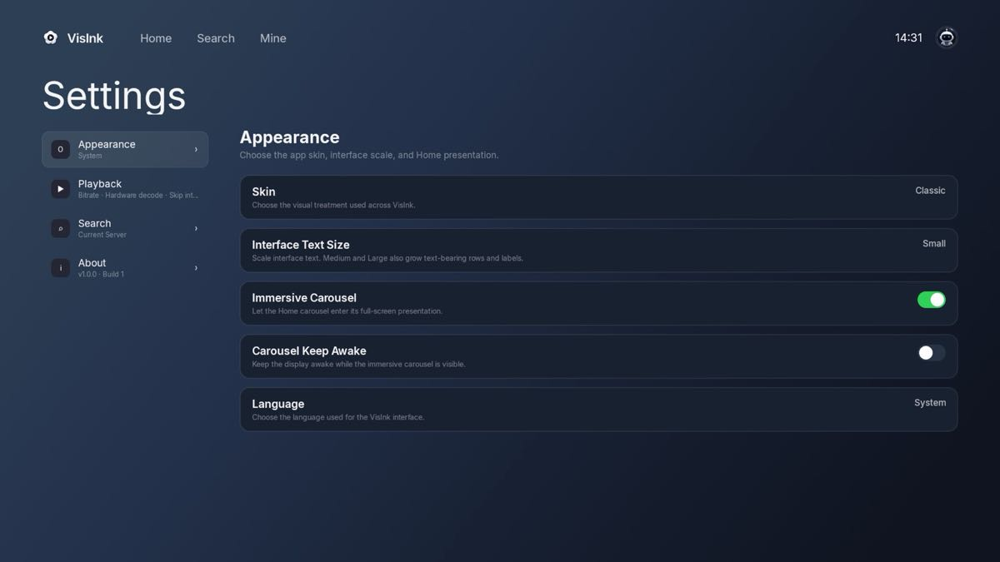

<h1 align="center">
  
  
  VisInk
</h1>

  <strong>English</strong> · <a href="README.zh.md">中文</a>

  Multimedia clients for your own library. 
  This repo is the <strong>free Android TV drop</strong> — sideload APKs, not Play Store, no subscription.

  
  &nbsp;
  

  <a href="https://github.com/skymei/VisInkAndroidTVRelease/releases/latest"><strong>Download the latest release</strong></a>

---

  

Home

  
  &nbsp;
  

Welcome · Sign in

  
  &nbsp;
  

Search · Details

  
  &nbsp;
  

Mine · Settings

---

VisInk is a client, not a streaming service. You run Emby; this app is the TV remote UI. APKs live on [Releases](https://github.com/skymei/VisInkAndroidTVRelease/releases) (the tags), not on the default branch. Overlay-install to update. **Do not uninstall first** — that wipes saved servers and login.

## Which APK

| File | Use |
|---|---|
| `VisInk-*-armeabi-v7a.apk` | 32-bit ARM. **Most TVs should use this.** |
| `VisInk-*-arm64-v8a.apk` | 64-bit ARM |
| `VisInk-*-universal.apk` | All ABIs, largest file. Use only if you are unsure. |

Package name: `com.skymei.visink`.

## Android TV version and hardware

| | Minimum | Recommended |
|---|---|---|
| System | Android TV / Google TV **7.0** (API 24) | Android TV / Google TV **12** or later |
| Device | A TV or box with the Android TV launcher and a D-pad remote. Phones and tablets are not supported. | A living-room set or box you actually use with a remote, 1080p or 4K |
| CPU | 32-bit ARM (`armeabi-v7a`) or 64-bit ARM (`arm64-v8a`) | Same as the TV: 32-bit box → v7a package; 64-bit box → arm64 package |
| Video | A hardware decoder for common files (at least H.264) | Hardware decode for H.264 and HEVC so most libraries direct-play |
| Network | Reach your Emby server from the TV | Wired or stable Wi-Fi to the server |
| Storage | ~100 MB for an ABI build; ~250 MB for universal | Same; leave headroom for artwork cache |

The UI is designed around 1080p Android TV. 4K sets work. This is not a phone APK.

## Current capabilities

- Emby login and saved session
- Multiple servers and accounts
- Home, library, search
- Movie / series details
- Person pages
- Continue watching and favorites
- Direct play; transcode when the TV cannot decode
- Subtitles, audio tracks, playback speed, next episode
- Appearance, playback, and search settings
- UI in Simplified Chinese, Traditional Chinese, English, Japanese, Korean, and more

## Feedback

This project is still early. Please bear with us if something is rough.

Open an [issue](https://github.com/skymei/VisInkAndroidTVRelease/issues) or email [support@visink.cc](mailto:support@visink.cc).

For a bug report, include as much as you can: which build, which TV or box, what you did, what you expected, and what happened. Screenshots or a short recording help a lot.
